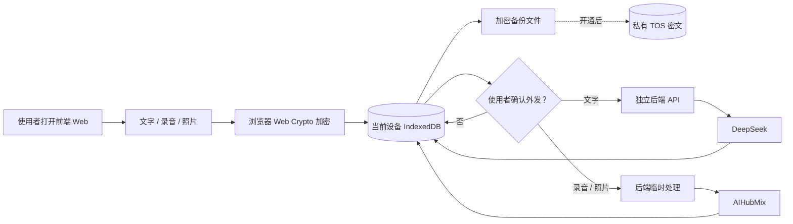

# 病历不归零·内测版

一个面向个人和家庭的健康记录工具：先完整保留原话、录音和照片，再在使用者明确同意后调用 AI 整理。AI 输出始终是待核对草稿，不是诊断、医嘱或用药决定。

## 当前状态

项目已从比赛演示架构转向内测版架构。代码在一个仓库中同时保留前端和后端，运行时是两个独立服务：使用者打开前端页面，前端再调用后端 API。当前代码已完成本地加密主数据、所有者访问保护、无状态 AI 边界、加密备份下载/预览/恢复、私有 TOS 短时授权接线、时间线筛选、修订历史、选中删除、就诊交接材料和内测问题记录。

仍未宣称完成的部分：

- 分别部署前端 Web 服务和后端 API 应用，并设置它们的正式地址；
- 新建私有 TOS Bucket、配置最小权限身份和浏览器 CORS，并在真实 Bucket 验证密文上传/下载；
- 真实手机录音、照片、断网与空间不足验收；
- 实际部署后的 R1–R13 全量验收和 `main` 发布。

## 数据怎么流动



恢复口令只在当前设备用于包装/解包数据密钥，不上传到函数服务或 TOS。丢失恢复口令时，服务器不能代为解密备份。

## 快速启动

需要 Python 3.12 和 Node.js 22+。

```bash
git clone https://github.com/Irixil/bing-li-bu-gui-ling.git
cd bing-li-bu-gui-ling
python3.12 -m venv .venv
source .venv/bin/activate
python -m pip install -r requirements-dev.txt
cp .env.example .env
```

在 `.env` 中填写：

- `APP_OWNER_PASSWORD` 或 `APP_OWNER_PASSWORD_SHA256`：保护在线 AI/备份能力；
- `APP_SESSION_SECRET`：至少 32 字节的随机值；
- `DEEPSEEK_API_KEY`：文字整理；
- `AIHUBMIX_API_KEY`：语音转写和照片识字。

启用私有云备份时需给函数绑定最小权限 IAM 角色，并设置 `TOS_REGION`、`TOS_ENDPOINT`、`TOS_PUBLIC_ENDPOINT` 和 `TOS_BUCKET`。veFaaS 会在每次请求中注入短期 STS 凭据，线上不保存长期 TOS AK/SK；角色权限只允许目标 Bucket 的备份前缀。

先检查配置（不调用模型）：

```bash
python -m scripts.start_app --check-config
```

一条命令同时启动两个独立服务：

```bash
python -m scripts.start_dev
```

请打开前端页面 <http://127.0.0.1:5173/>。后端 API 在 <http://127.0.0.1:18768/>，不需要手动打开。

需要分开启动时，使用两个终端：

```bash
python -m scripts.start_backend
python -m scripts.start_frontend
```

首次打开会在当前浏览器建立加密仓库。浏览器恢复口令与网站访问密码是两个不同的安全边界。

## 低成本 AI 组合

- 文字整理：DeepSeek `deepseek-chat`，只发送使用者当次选中的原文。
- 语音转写：AIHubMix 默认 `gemini-2.5-flash-lite`。
- 照片识字：AIHubMix 默认 `qwen3.7-flash`。
- 本地离线路径：不同意外发时，原话/原件仍可保存、修订、筛选、打印和备份。

所有付费请求都由使用者单次确认触发，失败后不自动重试。具体费用以各服务商当时账单为准。

## 验证

```bash
# Python 全量回归
python -m pytest -q

# 浏览器逻辑、加密仓库与安全规则
node --test tests/*.test.cjs

# 前后端接口类型
npm run check:contracts
```

2026-09-16 当前工作树验证结果：Python `765 passed`，Node `30 passed`，TypeScript 合同检查通过。真实本机浏览器也已从前端 `5173` 完成加密仓库、合成记录、刷新解锁和跨端口后端登录检查。这些结果证明当前代码回归，不替代真实手机和正式云环境验收。

## 安全约束

- `APP_MODE=local_first` 时，旧的 SQLite 健康数据 API 关闭，不用于公网保存用户健康资料。
- 在线 AI 接口需要签名、过期的 HttpOnly SameSite Cookie、精确前端来源和 CSRF 令牌。
- 函数处理的媒体写入临时文件，完成或失败后删除，不写入云端健康数据库。
- 离线危险提醒是有限描述匹配，不是医学评估；“未命中”不等于“正常”或“无风险”。
- 删除当前设备的记录不会自动改写旧的加密备份；界面必须在删除前说明这一点。

## 项目文档

- [已确认的前后端分离规格](docs/sdlc/spec-split-web-api.md)
- [已确认的单仓库双服务方案](docs/sdlc/plan-split-web-api.md)
- [AI 模型接入](docs/MODEL-CONNECTION.md)
- [当前 API 合同](docs/API.md)
- [验证记录](docs/VALIDATION.md)

项目代码目前未授予通用开源许可证。公开病例改编资料的独立许可以对应资料说明为准。
