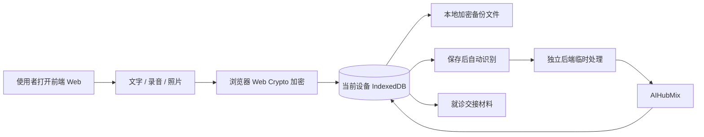

# 病历不归零·内测版

一个面向个人和家庭的健康记录工具：保存文字、录音和照片，自动识别媒体内容，再生成能直接给医生查看的就诊交接材料。AI 输出始终是待核对草稿，不是诊断、医嘱或用药决定。

## 当前状态

项目已从比赛演示架构转向内测版架构。代码在一个仓库中同时保留完整前端和后端，运行时是两个独立服务：使用者只打开 `5173` 上的图形前端，页面再调用 `18768` 上的后端 API。当前最小闭环是：本机加密保存 → 媒体自动识别 → 自动形成可核对记录 → 生成就诊交接材料。老人日常只输入本机恢复口令，不再输入网站密码，也不再处理家属绑定或逐次 AI 确认。

仍未宣称完成的部分：

- 分别部署前端 Web 服务和后端 API 应用，并设置它们的正式地址；
- 新建私有 TOS Bucket、配置最小权限身份和浏览器 CORS，并在真实 Bucket 验证密文上传/下载；
- 真实手机录音、照片、断网与空间不足验收；
- 实际部署后的 R1–R13 全量验收。

## 数据怎么流动



恢复口令只在当前设备用于包装/解包数据密钥，不上传到函数服务或 TOS。丢失恢复口令时，服务器不能代为解密备份。

## 快速启动

需要 Python 3.12 和 Node.js 22+。

```bash
git clone https://github.com/Irixil/bing-li-bu-gui-ling.git
cd bing-li-bu-gui-ling
python3.12 -m venv .venv
source .venv/bin/activate
python -m pip install -r requirements-dev.txt
cp .env.example .env
```

在 `.env` 中填写：

- `DEEPSEEK_API_KEY`：文字整理；
- `AIHUBMIX_API_KEY`：语音转写和照片识字。

启用私有云备份时需给函数绑定最小权限 IAM 角色，并设置 `TOS_REGION`、`TOS_ENDPOINT`、`TOS_PUBLIC_ENDPOINT` 和 `TOS_BUCKET`。veFaaS 会在每次请求中注入短期 STS 凭据，线上不保存长期 TOS AK/SK；角色权限只允许目标 Bucket 的备份前缀。

先检查配置（不调用模型）：

```bash
python -m scripts.start_app --check-config
```

一条命令同时启动两个独立服务：

```bash
python -m scripts.start_dev
```

请打开前端页面 <http://127.0.0.1:5173/>。后端 API 在 <http://127.0.0.1:18768/>，不需要手动打开。

需要分开启动时，使用两个终端：

```bash
python -m scripts.start_backend
python -m scripts.start_frontend
```

首次打开会在当前浏览器建立加密仓库。日常使用只需输入这个本机恢复口令。保存录音或照片后会直接开始识别，成功后自动形成记录；不需要额外的家属绑定或发送确认。

## 低成本 AI 组合

- 文字整理：DeepSeek `deepseek-chat`，只发送使用者当次选中的原文。
- 语音转写：AIHubMix 默认 `gemini-2.5-flash-lite`。
- 照片识字：AIHubMix 默认 `qwen3.7-flash`。
- 本地主数据：原话和原件仍可保存、修订、筛选、打印和备份。

媒体保存后会自动产生一次付费识别请求；失败后不自动重试，只在使用者点击重试时再次调用。具体费用以各服务商当时账单为准。

## 验证

```bash
# Python 全量回归
python -m pytest -q

# 浏览器逻辑、加密仓库与安全规则
node --test tests/*.test.cjs

# 前后端接口类型
npm run check:contracts
```

2026-09-18 当前工作树验证结果：Python `770 passed`，Node `38 passed`，TypeScript 合同检查通过。真实隔离浏览器在 Mock AI 下完成了单一本机口令建库、照片原件保存、无弹窗自动识别、自动建立记录、读取和生成就诊交接材料。这些结果证明当前代码闭环，不替代真实手机和正式云环境验收。详细记录见 [最小闭环浏览器验证](docs/evidence/minimal-loop-browser-2026-09-18.md)。

## 安全约束

- `APP_MODE=local_first` 时，旧的 SQLite 健康数据 API 关闭，不用于公网保存用户健康资料。
- 在线 AI 接口只接受配置好的精确前端来源，API 密钥不下发前端。
- 当前无登录、无设备绑定的 MVP 只用于本地或受控内测；加入限流或新的简化保护前，不要把可消耗 AI 额度的后端直接公开到互联网。
- 函数处理的媒体写入临时文件，完成或失败后删除，不写入云端健康数据库。
- 离线危险提醒是有限描述匹配，不是医学评估；“未命中”不等于“正常”或“无风险”。
- 删除当前设备的记录不会自动改写旧的加密备份；界面必须在删除前说明这一点。

## 项目文档

- [已确认的最小闭环规格](docs/sdlc/spec-minimal-loop-v4.md)
- [已确认的最小闭环实施方案](docs/sdlc/plan-minimal-loop-v4.md)
- [AI 模型接入](docs/MODEL-CONNECTION.md)
- [当前 API 合同](docs/API.md)
- [验证记录](docs/VALIDATION.md)

项目代码目前未授予通用开源许可证。公开病例改编资料的独立许可以对应资料说明为准。
